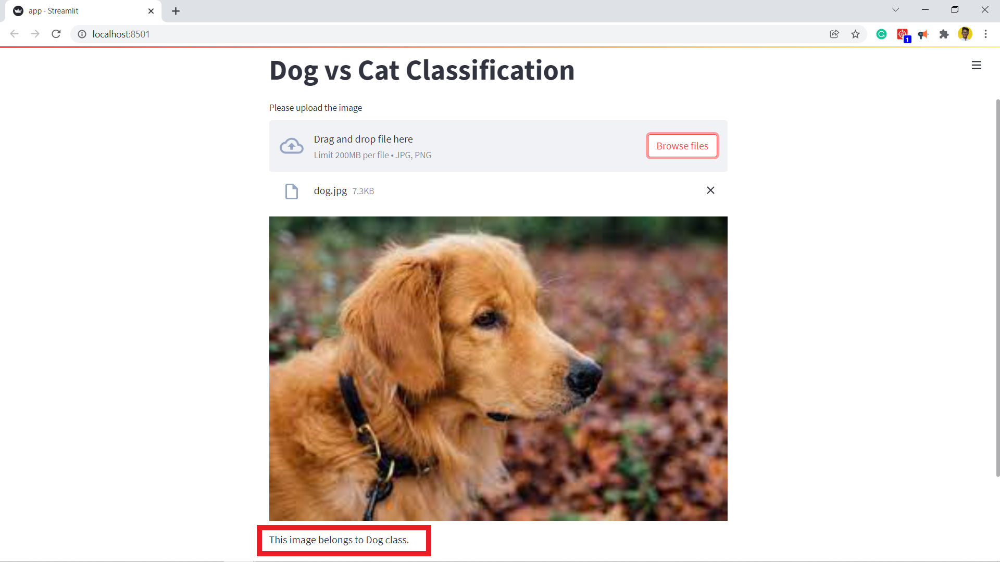

# CNN-Animal-Classification-Web-App-Streamlit
Jupyter notebook implementation:-
[CNN-Animal-Classification.ipynb](https://colab.research.google.com/drive/1qO_Ds_5C_MpphYT6S5x8nxQhQvz61LLf)
## Project Description
### Working on Image dataset - 

* This dataset contains images of Dogs and cats on which the CNN model is built. 
* It has 2 image classes of dogs and cats
* Each data point is a 3D image of either a Dog or Cat.
* The CNN model was trained on 4000 images of Dogs and 4000 images of Cats and tested on 1000 images on Dogs and 1000 images of Cat

Example of the data points:- 


## Tech
The project uses the following technologies/packages :- 

- 
- 
- 
- 
- 
- 
- 
- 
- [](https://code.visualstudio.com/)
- 


## Installation:-

All the packages related to this project have been listed down in the requirements.txt file.

* Install the packages in active environment using:-
```
pip install requirements.txt
```
------------
* For working in isolated conda environments:-
1. Create a virtual environment in conda at the default location in windows:
```
conda create -n env_name
```
-----------
2. To create a virtual env in the current working directory:-
```
conda create --prefix ./envs
```
-----------
* To run the main python script of the project:-
```
python cnn_dog_cat_classifier.py
```

* To run the Streamlit webapp associated with this project :-
```
streamlit run app.py
```
# Project Development 

#### What?
* I have created this CNN project that aims at classifying any type of dog and cat when the image is provided.
* After running the main script the model will be trained on the training data and would be ready to be tested on unknown data of images of cats and dogs.
* I have created a hassle free webapp using streamlit where simply the images of dog and cat can be fed and the CNN model associated with the webapp would take in the photo and process it and give out the result.


#### Webapp implementation :-





## Author:-
[Karthik Arumugam](https://github.com/KarthikArumugam3)
[Follow me on LinkedIN](https://www.linkedin.com/in/karthikarumugamd/)
